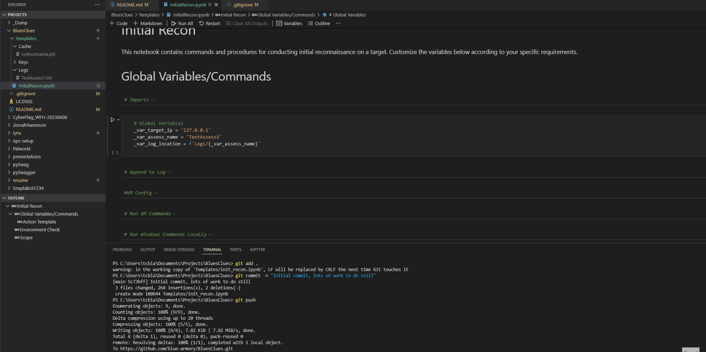

# Blues Clues
A collection of scripts/notebooks for setting up red team assessments using Jupyter Notebooks

## Demo v.1.1.0


## Setup
### Interacting with VM
First setup SSH on the VM to handle the key connection:  

```bash
ssh-keygen -t rsa -b 4096
ssh-keygen -p -m PEM -f /path/to/your/openssh_key
#Ensure PubkeyAuthentication yes is uncommented in /etc/ssh/sshd_config  
cat ~/.ssh/id_rsa.pub > ~/.ssh/authorized_keys
systemctl restart sshd
```
### Configure sudoer permissions 
```bash
sudo visudo
#Add <username> ALL=(ALL) NOPASSWD: ALL
#CTRL+O
#Enter
#CTRL+X
```
_Note: Definitely not best practice, added sudoer issue to bugs_  

## Considerations
_BLUF:_ Handle output from each action carefully
Had an issue when using variables generated dynamically (for example, getting 'ext_ip' and using in a subsequent cell) because a '\n' was appended to the end. I fixed this with a strip in the output, but unclear whether this should be handled on a case-by-case basis or if the newly created command format is handled poorly.

## Development
### Version v1.1.0
- Started InfraxSetup.ipynb
- Added action templates and ability to execute from VM or local Windows host
- Caching and Logging initial setup

### Version v1.2.0
- Added 'skip' option to 'Action Template'
- Moved global variables and most functions to separate file to allow multiple page access

### Version v1.2.1
- Added `command_scp_put_vm` to templates.py to facilitate keeping a shared loot directory between Jupyter notebook and VM
- Added `vm_loot_dir` to InfraxSetup. This decisions now somewhat forces InfraxSetup to be run first to initialize vm directory structure.
- Added NMAP Basic and Robust alive scans to InitialRecon
  - Lots of TODO and notes, and will need some trial and error testing
- Started working on 'Loot' directory structure, currently supports creating '..._attack_surface' from NMAP Robust scan which should be able to be referenced in subsequent actions
  - May need to add a separate Python file to manage loot


### TODO/Worklog
#### General
- [ ] Finish project _4Head_
- [ ] Set the notebook to automatically query for infrastructure information and store for future use
- [x] Fix the "cell_executed" functionality to avoid re-running blocks that already have output associated (unless forced)
  - Added Jupyter "pickles" which requires each cell to have a cell command to pass to the caching function, and either add to cache or display
  - Also added 'force_run' to the top of every cell to easily set whether the cell needs to be run again
- [x] Add a way to define what cells are executed based on "assessment type" (probably just need to set the variable at the top, or maybe create separate files based on assessment type for readability)
  - Might need to just make different templates for each assessment type, this should lead to a cleaner setup
  - Just going to use subfolders, need to have a better methodology to define it first though. First version will just be for internal assessment.
- [x] Fix SSH using key (probably local issue, fix permission error on Nix)
  - [ ] Add better error handling if key isn't working
- [ ] Add "loot" and "targets" feature to logs or commands to store specific info that can be used in future commands/good to know
- [ ] Build out Installation in README.md, and a requirements.txt
- [x] Consider adding Infrastructure Setup page
  - [ ] Add a new command type for 'command_vm_proxy' which checks proxychains config and shows in logs the attack chain
  - [ ] Add checks to see if VM is bridged/using VPN address (curl ip.beer or ipconfig and compare IPs)
- [ ] Add error reporting in Windows/VM command
- [x] Fix/streamline the command syntax within each cell to make a more repeatable method of creating new actions
  - Added '#Action Template' and all command handling is done in the same cell as caching now (with a handover to each cell for Windows/VM)
  - Consider adding 'Actions' class and combining Windows/VM into same cell
  - All done, and added to templates.py
- [ ] Make a way to import 'Actions' that are internal only (or just keep the Github repo private)
- [ ] Add different action templates/reference functions for NMAP, Bloodhound, LDAP queries which have complex results/switches
  - Might not be necessary, the actions are somewhat clean in InitialRecon
- [ ] Its annoying having to run above cells in each notebook, consider adding all necessary imports into each action

#### Bugs
- [ ] In command_exe_* the error output when returned with result returns a tuple and looks bad in output. The new way I reformatted command syntax made the error text show the ssh comms output. Need to handle that better in case there is errors (or maybe its a non-issue, needs testing)
  - See the comment section in templates.py under command_exe_vm
- [ ] Some nmap scans require root privs on VM, may need to add a check for privilege level on VM
  - Added temporary fix to [configure sudo](#configure-sudoer-permissions) above


#### InfraxSetup
- [ ] Add more options to read from file (depending on what information is available)
- [ ] Finish functions on page
- [ ] Create requests 'template' as multiple actions have webpage input
- [ ] Finish 'Domain Categorization' by incorporating [DomainCat](https://github.com/l0gan/domainCat) into actions

#### InitialRecon
- [ ] Finish functions on page